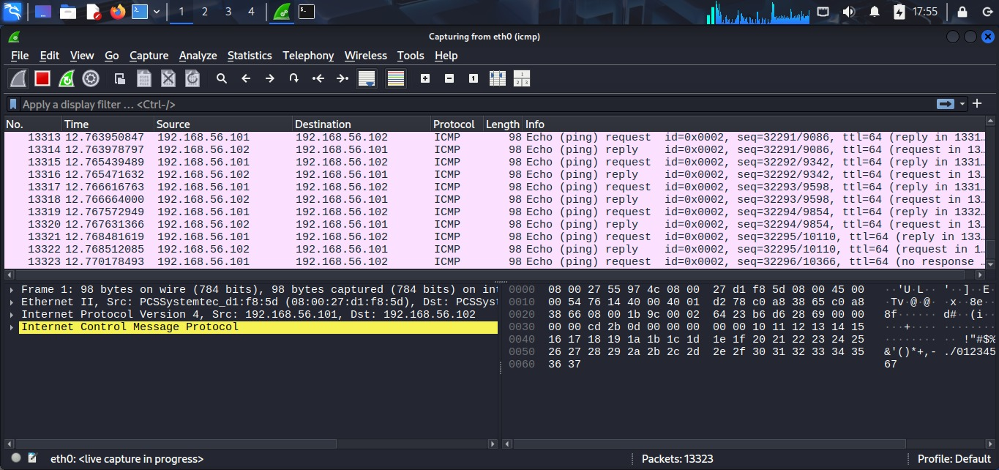
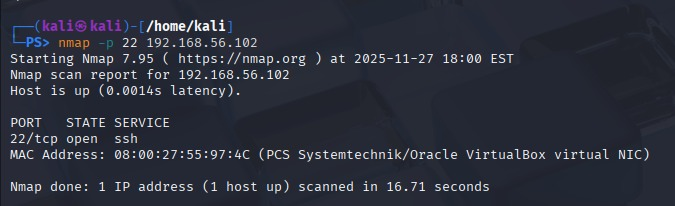
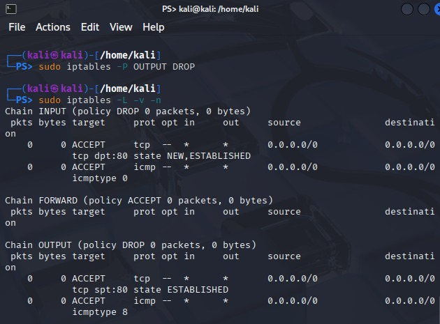
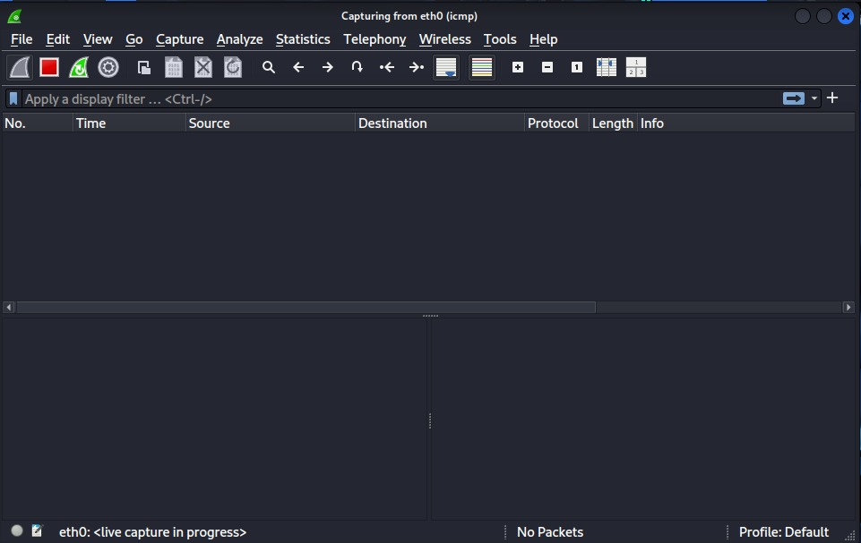
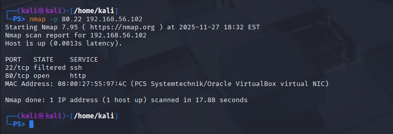
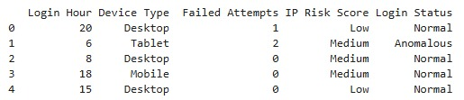
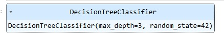
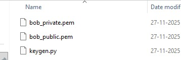
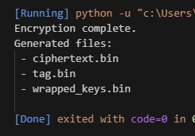
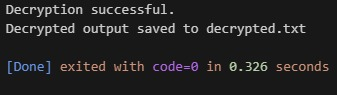

# **CSCI 5743 – Assignment 4: Defense against CI Intrusions**

**Semester:** Fall 2025
**Student Name:** [Deeksha Reddy Patlolla]
**Student ID:** [111444513]
**Total Points:** 200

---

## **Part 1: Conceptual Questions (65 pts)**

---

### **Task 1: Real-World Breach Analyses (30 pts)**

#### **1. Capital One Cloud Breach (2019)**

**Prompt:** Explain how principles like *Least Privilege*, *Separation of Duties*, and *Continuous Monitoring* were violated in this breach, and how proper enforcement would have limited or prevented unauthorized access.

*(Least Privilege Violation: The AWS Web Application Firewall (WAF) role's permissions were overly expansive, granting access to several S3 buckets unrelated to its primary duties. Capital One produced an excessive explosion radius by not limiting the function to the bare minimum of acts. Mass data exfiltration was made possible by the attacker's ability to get access rights well beyond what the service required once they took use of the SSRF vulnerability.)*

*(Violation of Separation of Duties: The WAF position also included several duties that ought to have been kept apart, such as data access, recording, and inspection. Because responsibilities were not segregated, compromising one element (the WAF) made it possible for lateral movement into data-handling processes, blurring the lines that ought to separate the data and infrastructure layers.)*

*(Continuous Monitoring Violation: The unusual S3 access patterns were not detected by alerting or anomaly detection. Large-scale bucket listing and item retrieval queries were carried out by the attacker, but no automatic monitoring set out an alarm. Unusual API requests, privilege escalations, or high-volume readings would have been detected by ongoing monitoring.)*

*(If principles were enforced: The WAF role would not have been able to access sensitive S3 buckets if the principles of least privilege had been followed. The WAF would not have been able to function as a data-access job if there had been separation of duties. Continuous monitoring would have limited the breach by identifying questionable requests early on. When combined, these safeguards might have greatly lessened the effect of the incident or stopped illegal access.)*

---

#### **2. Equifax Breach (2017)**

**Prompt:** Analyze the role of *Fail‑Safe Defaults* and *Least Functionality* in this breach. How would applying these principles have prevented external access to the vulnerable application?

*(Fail-Safe Defaults Failure: The Apache Struts system was not set up with deny-by-default principles and was directly connected to the internet. The system continued to allow incoming communication to superfluous components while being aware of the vulnerability. Unless specifically permitted, a fail-safe arrangement would have prevented external access. The attack surface remained completely exposed due to liberal defaults.)*

*(Least Functionality Failure: Public-facing services did not depend on the vulnerable Struts component. The attack surface was greatly expanded by keeping up superfluous services. Disabling software, ports, and components that are not necessary for operation is necessary for Least Functionality. Equifax left other frameworks open, providing a point of access for hackers.)*

*(How appropriate enforcement would be beneficial: If Fail-Safe Defaults had been used, external actors would not have been able to access the service unless it was properly set up to permit inbound access. The vulnerable Struts endpoint would have been completely deactivated if Least Functionality had been adhered to, eliminating the attack vector. The vulnerability would not have been externally exploitable even if it had not been fixed. These guidelines would have significantly decreased danger and avoided first entry.)*

---

#### **3. Target Breach (2013)**

**Prompt:** Identify the failures in *Network Segmentation* and *Zero Trust*. How would implementing stronger segmentation and stricter access verification have blocked lateral attacker movement?

*(Network Segmentation Failure: Target kept its internal network flat, making it easy to access important systems (such point-of-sale networks) and third-party vendor systems. With no internal firewalls or segmentation checkpoints, attackers spread laterally over the entire company network after the HVAC vendor's credentials were obtained.)*

*(Zero Trust Failure: Internal network communication was implicitly trusted, resulting in a zero trust failure. Attackers were not needed to re-authenticate or provide justification for access to new systems once they had been authenticated using the stolen vendor credentials. Instead than supposing internal users are reliable, Zero Trust demands identity and intent verification at every stage.)*

*(How effective segmentation would be beneficial: Vendor networks and payment processing systems would have been separated by strong segmentation. The attacker would be limited to a narrow subnet even if they had stolen credentials. Lateral movement would have been prevented by internal ACLs and micro-segmentation.)*

*(How Zero Trust might be beneficial: Sensitive systems could not have been accessed by hacked vendor accounts thanks to continuous identity validation and least-privilege access. Unauthorized traversal would be prevented and anomalous access attempts would be identified by strict access verification at each hop.)*

---

#### **4. SolarWinds Supply Chain Attack (2020)**

**Prompt:** Discuss the lack of *Zero Trust*, *Continuous Monitoring*, and *Open Design*. How could implementing these principles have contained the spread or improved detection?

*(Zero Trust Failure: SolarWinds Orion updates were implicitly trusted by organizations. The over-reliance on perimeter trust was highlighted by the corrupted update, which was digitally signed and regarded as reliable. Zero Trust would have necessitated ongoing software activity authentication and behavioral monitoring, even if the activity came from a "trusted" source.)*

*(Failure of Continuous Monitoring: The installed SUNBURST backdoor continued to function undetected for several months. Unnoticed were privilege escalations, lateral movement, and command-and-control communications. Anomalies in update compilation or outgoing network patterns would have been discovered by ongoing build system and runtime behavior monitoring.)*

*(Open Design Failure: Transparent, verifiable security measures were absent from supply chain operations. Attackers were able to install malicious code undetected due to limited insight into development environments and inadequate validation methods. Transparency, repeatable builds, and multi-party verification are all promoted by open design.)*

*(How enforcement would be beneficial: Zero Trust would limit Orion's access to customer environments and continually verify conduct. Anomalies in build processes or unusual runtime traffic would be found by continuous monitoring. Stricter transparency and integrity checking would be implemented under Open Design, lowering the possibility of undetected manipulation.)*

---

#### **5. Colonial Pipeline Ransomware (2021)**

**Prompt:** Explain the breakdown of *Accountability & Non‑repudiation*, *Continuous Monitoring*, and *Layered Defense*. How would enforcing these principles—especially MFA and audit logging—have changed the attacker’s access path?

*(Accountability & Non-Repudiation Failure: MFA and robust identity verification were absent from Colonial's VPN account. After obtaining credentials, the attacker might log in without further verification, resulting in inadequate auditability of access origin and behavior.)*

*(Failure of Continuous Monitoring: Lateral movement, suspicious authentication attempts, and privilege escalations were not quickly identified. No real-time notifications regarding odd system interactions, geographical abnormalities, or anomalous login times were present.)*

*(Layered Defense Failure: Inadequate depth in authentication and authorization tiers was demonstrated by the widespread access to internal systems made possible by a single hacked VPN credential. MFA, network segmentation, endpoint security, and behavioral analytics would all be included in a layered design.)*

*(If principles were enforced: Strong MFA would have prevented access using credentials that were stolen if the principles had been maintained. Early detection of odd login locations or time-of-day abnormalities would be possible with continuous monitoring. Even with VPN access, Layered Defense would make sure the attacker couldn't access live networks or freely spread ransomware.)*

---

### **Task 2: MITRE ATT&CK → D3FEND Mapping (20 pts)**

#### **ATT&CK ↔ D3FEND Mapping Table**

| **Tactic**      | **Technique (ID & Name)** | **Scenario Use** | **D3FEND Countermeasure 1 (Name / Category)** | **Justification** | **D3FEND Countermeasure 2 (Name / Category)** | **Justification** |
| --------------- | ------------------------- | ---------------- | --------------------------------------------- | ----------------- | --------------------------------------------- | ----------------- |
| Initial Access  |   Spearphishing Attachment (T1566.001)                        |    Attacker sends malicious attachment to employee              |  Email Filtering/Isolate                                             |  Before emails containing dubious attachments are sent to users, they are filtered and quarantined.                 | Message Authentication (SPF/DKIM/DMARC)/Harden                                                 | reduces the number of successful phishing attempts by preventing fake emails.                | 
| Persistence     |  Install Backdoor (T1055/variant)                         |  Malware installs a persistent foothold                |  Process Behavior Analysis/Detect                                             | detects unusual long-lived or self-starting processes                   | Execution Isolation/Isolate                                            |  Unknown executables are sandboxed to avoid extensive system change.              | 
| Defense Evasion | Obfuscated/Encrypted Payloads (T1027)                          | Attacker uses packing/encoding to evade detection                 |  Binary Padding Analysis/ Detect                                             |  finds executables that appear to be obfuscated or padded..                  | Malware Object Linking/Harden                                                | To identify illegal changes, binaries are linked to known-good signatures.                  | 
| Discovery       |  System Network Discovery (T1016)                         | Attacker scans internal environment                 |  Network Traffic Analysis/Detect                                             | Identifies scanning, enumeration , recon attempts.                   |  Network Isolation/ Isolate                                             |  divides the network into segments to restrict the scope of attacker discovery.                 |
| Exfiltration    | Exfiltration Over C2 Channel (T1041)                          | Attacker sends data over encrypted C2                 | Data Transfer Size Monitoring/Detect                                               | detects anomalous outgoing data flows.                  | Protocol Tunneling Detection/Detect                                               | detects secret or encrypted C2 actions.                  |

*(This mapping shows how D3FEND countermeasures offer a multi-layered defensive strategy for every stage of an incursion. Detect controls spot harmful activity early, Harden and Isolate controls restrict attack surface and lateral movement, and Deceive tactics make attacker reconnaissance more difficult. These protections create a multi-layered security approach that is in line with contemporary cyber defense systems when used comprehensively.)*

---

### **Task 3: NIST CSF ↔ SP 800‑53 Mapping (15 pts)**

#### **Table: CSF Functions Mapped to Controls**

| **CSF Function** | **Category / Subcategory** | **SP 800‑53 Controls** | **Explanation (How the control operationalizes the CSF outcome)** |
| :--------------- | :------------------------- | :--------------------- | :---------------------------------------------------------------- |
| Protect          |  PR.AA-02 – Access is limited to authorized users, processes, and devices.                          |  AC-2 (Account Management), IA-2 (Identification & Authentication)                      | IA-2 implements MFA and robust identity verification, whereas AC-2 controls account creation, modification, deactivation, and review. When combined, they guarantee that only identities with permission may access vital operating systems.                                                                  |
| Detect           | DE.CM-07 – Monitoring for unusual activity is performed.                           | AU-6 (Audit Review), SI-4 (System Monitoring)                       | While AU-6 makes sure records are examined for questionable activity, SI-4 permits ongoing monitoring for abnormalities and possible intrusions. Real-time detection in critical infrastructure is operationalized via these rules.                                                                  |
| Respond          | RS.MI-01 – Incidents are contained.                           | IR-4 (Incident Handling), CP-2 (Contingency Planning)                       |  IR-4 offers protocols for minimizing, recovering from, and controlling security events. CP-2 guarantees the existence of continuity strategies to sustain critical infrastructure operations both during and following an event.                                                                 |

*(Add rows or modify functions as appropriate.)*

---

## **Part 2: Hands‑On Labs (135 pts)**

---

### **Task 1: Firewall Configuration & Analysis (45 pts)**

#### **1️⃣ Baseline Testing (before firewall)**

**Screenshots:**

* 
* 

**Observations:**
*(Describe pre‑firewall network behavior – open ports, ping responses, service reachability.)*

---

#### **2️⃣ Firewall Rule Application**

**Commands Executed:**

```bash
# Insert your configured iptables commands here
```

**Screenshot:**


---

#### **3️⃣ Post‑Firewall Testing & Analysis**

**Screenshots:**

* 
* 

**Observations:**
*(Explain how connectivity changed; identify allowed/blocked ports; discuss stateful behavior.)*

---

#### **Analysis Questions**

1. Why specify `NEW,ESTABLISHED` in the INPUT chain for port 80?
   *(Your answer)*
2. Why only `ESTABLISHED` on OUTPUT for port 80?
   *(Your answer)*
3. What risks arise if state tracking is omitted?
   *(Your answer)*
4. Why limit ICMP by type instead of state?
   *(Your answer)*
5. What changed after applying the firewall?
   *(Your answer)*
6. Did the rules behave as intended?
   *(Your answer)*
7. What extra rules are advisable for a DMZ server?
   *(Your answer)*
8. How do these rules enforce *attack surface minimization*?
   *(Your answer)*
9. How does this embody *least privilege*?
   *(Your answer)*
10. How do default DROP policies support *fail‑safe defaults*?
    *(Your answer)*

---

### **Task 2: Login Anomaly Detection with ML (45 pts)**

#### **Environment Setup**

* IDE used: [ ] Jupyter / VS Code / PyCharm
* Python Version: [ ]
* Libraries installed: `pandas`, `scikit‑learn`

---

#### **1️⃣ Dataset Inspection**

**Screenshot:** 
*(Describe dataset columns, target variable.)*

---

#### **2️⃣ Model Training Output**

**Code Executed:**

```python
# Show model initialization and metrics printout
```

**Screenshot:** 

---

#### **3️⃣ Evaluation Metrics**

| Metric    | Value |
| :-------- | :---- |
| Accuracy  |       |
| Precision |       |
| Recall    |       |
| F1 Score  |       |

---

#### **Analysis Questions**

1. Report metrics above (with screenshot).
2. How many predictions total?
3. Number of False Positives / False Negatives?
4. Real‑life risks of FP/FN in security?
5. Define precision vs recall.
6. Why may accuracy mislead on imbalanced data?
7. Why view all metrics together?
8. Purpose of F1‑score in security?
9. Did your F1 lean toward precision or recall and why?
10. If attacker spoofs a key feature, will model detect it?
11. What synthetic values could mimic stealth logins?
12. What new features should be logged for future models?

---

### **Task 3: Secure File Exchange (Hybrid Crypto) (45 pts)**

#### **1️⃣ Key Generation**

**Screenshot:** 
*(Show creation of bob_public.pem and bob_private.pem.)*

---

#### **2️⃣ Encryption**

**Screenshot:** 
*(Show AES‑CTR encryption and RSA key wrap execution.)*

---

#### **3️⃣ Decryption & Integrity Verification**

**Screenshot:** 

---

#### **4️⃣ Testing Outcomes**

| **Test Case**         | **Expected Result**                   | **Observed Outcome** | **Status (Pass/Fail)** |
| --------------------- | ------------------------------------- | -------------------- | ---------------------- |
| Successful Round‑Trip | Decrypted text matches original       |                      |                        |
| Tamper Test           | Integrity check fails (HMAC mismatch) |                      |                        |
| Wrong RSA Key         | Decryption fails – cannot unwrap key  |                      |                        |

---

#### **Analysis Questions**

### 🧭 **Analysis Questions**

1. Why do we combine **RSA** and **AES** instead of encrypting the file directly with RSA?
   *(your answer here)*
2. What would happen if you reused the **IV** in AES-CTR?
3. How does **RSA-OAEP** protect the symmetric keys compared to basic RSA encryption?
4. Why is the **HMAC key** different from the **AES encryption key**? What are the risks of reusing the same key for both?
5. What specific attacks can **HMAC-SHA256** defend against in this file exchange scenario?
6. Why do we authenticate both the **IV** and the **ciphertext** with HMAC instead of only the ciphertext?
7. How would the system behave if the HMAC check fails during decryption, and why is this behavior important?
8. Why is the **encrypt-then-MAC** design used instead of MAC-then-encrypt or encrypt-and-MAC?
9.  Which **NIST CSF Function(s)** and **SP 800-53 Rev. 5 controls** does this hybrid cryptosystem most directly support?
10. How does this implementation reflect the principles of **least privilege**, **fail-safe defaults**, and **trust boundaries** at the cryptographic level?


